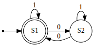

# Finite-state machines with dot

**fsmdot** is a Python package to create finite-state machines which can be exported to dot format. It uses the [pygraphviz](https://pygraphviz.github.io/) library which is a Python interface to the [Graphviz](https://graphviz.org/) graph layout and visualization package.

## Installing
- First, you need to install Graphviz. See how to download it [here](https://graphviz.org/download/).
- Then, *fsmdot* can be installed using [pip](https://pip.pypa.io/en/stable/):
```
pip3 install fsmdot
```

## Usage
With the *fsmdot* library, you can create two different types of finite-state machine:
- **Deterministic finite automaton** (DFA)
- **Nondeterministic finite automaton** (NFA)

A finite-state machine is represented by a quintuple (Q, S, T, q0, F) where:
- **Q** is a list of states
- **S** is the input alphabet (a list of symbols)
- **T** is the state-transition table
- **q0** is the initial state, an element of Q
- **F** is the set of accept states

The order of states and symbols is important in Q and S
to make the state-transition table.

### Deterministic finite automaton
This is how to create a deterministic finite automaton.
- Fisrt, we import the **Dfa** class:
```python
from fsmdot.dfa import dfa
```
- Create the list of states:
```python
Q = ['S1', 'S2']
```
- Create the list of symbols representing the input alphabet:
```python
S = ['0', '1']
```
- Create the state-transition table. The rows corresponds to states (in the same order than in the Q list) and the columns corresponds to the symbols (in the same order than in the S list):
```python
T = [
    ['S2', 'S1'],
    ['S1', 'S2']
]
```
- Create the initial state (the state must be in Q):
```python
q0 = 'S1'
```
- Create the set of accept states (the states must be in Q):
```python
F = {'S1'}
```
- Then, you can create the DFA:
```python
a = Dfa(Q, S, T, q0, F)
```
- To see the state-transition table, use the **print_table** method:
```python
a.print_table()
```
This is the result:
```
+---------+-----+-----+
|         |   0 |   1 |
+=========+=====+=====+
| -> * S1 |  S2 |  S1 |
+---------+-----+-----+
|      S2 |  S1 |  S2 |
+---------+-----+-----+
```
- You can check if a string is accepted by the automata using the **accept** method:
```python
print(a.accept('11110'))
print(a.accept('110110110101'))
```
This is the result:
```
False
True
```
- To create the dot graph representing the DFA, use the **dot_graph** method. It creates a graph object.
```python
G = a.dot_graph()
```
You can print the string representation of the graph using the **to_string** method or write this content in a file using the **write** method (see [pygraphviz](https://pygraphviz.github.io/)):
```python
print(G.to_string())
G.write('graph1_dfa.dot')
```
Result:
```
strict digraph DFA {
        graph [rankdir=LR];
        node [shape=circle];
        S1      [shape=doublecircle];
        S1 -> S1        [label=1];
        S1 -> S2        [label=0];
        S2 -> S1        [label=0];
        S2 -> S2        [label=1];
        null    [shape=point];
        null -> S1;
}
```
File *graph1_dfa.dot*:



### Nondeterministic finite automaton
Example:
```python
from fsmdot.nfa import Nfa

Q = [1, 2, 3, 4]
S = [Nfa.EPSILON, '0', '1']
T = [
    [{3}, {2}, {}],
    [{}, {}, {2, 4}],
    [{2}, {4}, {}],
    [{}, {3}, {}]
]
q0 = 1
F = {3, 4}

a = Nfa(Q, S, T, q0, F)
a.print_table()

G = a.dot_graph()
G.write('graph6_nfa.dot')

# Calculations of epsilon closure
for state in Q:
    print(state, a.epsilon_closure(state))

# Conversion to DFA
dfa = a.to_dfa()
dfa.print_table()
G2 = dfa.dot_graph()
G2.write('graph6_dfa.dot')
```

## Examples
To see how the library works, look at the examples in the *examples* folder.

## References
- [Automata theory](https://en.wikipedia.org/wiki/Automata_theory)
- [Finite-state machines](https://en.wikipedia.org/wiki/Finite-state_machine)
- [Deterministic finite automaton](https://en.wikipedia.org/wiki/Deterministic_finite_automaton)
- [Nondeterministic finite automaton](https://en.wikipedia.org/wiki/Nondeterministic_finite_automaton)
- [Powerset construction](https://en.wikipedia.org/wiki/Powerset_construction)
- [DFA minimization](https://en.wikipedia.org/wiki/DFA_minimization)

## Author
[Quentin Deschamps](mailto:quentindeschamps18@gmail.com)

## License
[MIT](https://choosealicense.com/licenses/mit/)
