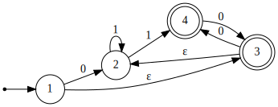

# Finite-state machines with dot

**fsmdot** is a Python package to create finite-state machines which can be exported to dot format. It uses the [pygraphviz](https://pygraphviz.github.io/) library which is a Python interface to the [Graphviz](https://graphviz.org/) graph layout and visualization package.

## Installing
- First, you need to install Graphviz. See how to download it [here](https://graphviz.org/download/).
- Then, *fsmdot* can be installed using [pip](https://pip.pypa.io/en/stable/):
```
pip3 install fsmdot
```

## Usage
With the *fsmdot* library, you can create two different types of finite-state machine:
- **Deterministic finite automaton** (DFA)
- **Nondeterministic finite automaton** (NFA)

A finite-state machine is represented by a quintuple (Q, S, T, q0, F) where:
- **Q** is a set of states
- **S** is a set of input symbols (alphabet)
- **d** is a dictionnary containing the transitions
- **q0** is the initial state
- **F** is the set of accept states

### Deterministic finite automaton
This is how to create a deterministic finite automaton.
- First, we import the **Dfa** class:
```python
from fsmdot.dfa import Dfa
```
- Create the set of states:
```python
Q = {'S1', 'S2'}
```
- Create the set of symbols representing the input alphabet:
```python
S = {'0', '1'}
```
- Create the transitions as a dictionnary.
```python
d = {
    'S1': {
        '0': 'S2',
        '1': 'S1'
    },
    'S2': {
        '0': 'S1',
        '1': 'S2'
    }
}
```
- Create the initial state (the state must be in Q):
```python
q0 = 'S1'
```
- Create the set of accept states (the states must be in Q):
```python
F = {'S1'}
```
- Then, you can create the DFA:
```python
a = Dfa(Q, S, d, q0, F)
```
- To see the state-transition table, use the **print_table** method:
```python
a.print_table()
```
This is the result:
```
+---------+-----+-----+
|         |   0 |   1 |
+=========+=====+=====+
| -> * S1 |  S2 |  S1 |
+---------+-----+-----+
|      S2 |  S1 |  S2 |
+---------+-----+-----+
```
- You can check if a string is accepted by the automata using the **accept** method:
```python
print(a.accept('11110'))
print(a.accept('110110110101'))
```
This is the result:
```
False
True
```
- To create the dot graph representing the DFA, use the **dot_graph** method. It creates a graph object.
```python
G = a.dot_graph()
```
You can print the string representation of the graph using the **to_string** method or write this content in a file using the **write** method (see [pygraphviz](https://pygraphviz.github.io/)):
```python
print(G.to_string())
G.write('graph1_dfa.dot')
```
Result:
```
strict digraph FSM {
	graph [rankdir=LR];
	node [shape=circle];
	null	[shape=point];
	S1	[shape=doublecircle];
	null -> S1;
	S1 -> S1	[label=1];
	S1 -> S2	[label=0];
	S2 -> S1	[label=0];
	S2 -> S2	[label=1];
}
```
File *graph1_dfa.dot*:


### Nondeterministic finite automaton
You can also create nondeterministic finite automatons using the **Nfa** class.
- To add epsilon-moves, use the symbol **Nfa.EPSILON**.

Example:
```python
from fsmdot.nfa import Nfa

Q = {1, 2, 3, 4}
S = {Nfa.EPSILON, '0', '1'}
d = {
    1: {
        Nfa.EPSILON: {3},
        '0': {2}
    },
    2: {
        '1': {2, 4}
    },
    3: {
        Nfa.EPSILON: {2},
        '0': {4}
    },
    4: {
        '0': {3}
    }
}
q0 = 1
F = {3, 4}

a = Nfa(Q, S, d, q0, F)
a.print_table()

G = a.dot_graph()
G.write('graph6_nfa.dot')
```
State-transition table:
```
+------+-----+--------+-----+
|      |   0 |      1 |   ε |
+======+=====+========+=====+
| -> 1 | {2} |     {} | {3} |
+------+-----+--------+-----+
|    2 |  {} | {2, 4} |  {} |
+------+-----+--------+-----+
|  * 3 | {4} |     {} | {2} |
+------+-----+--------+-----+
|  * 4 | {3} |     {} |  {} |
+------+-----+--------+-----+
```
File *graph6_nfa.dot*:



- To calculate the epsilon closure of a state, use the **epsilon_closure** method.
```python
# Calculations of epsilon closure
for state in Q:
    print(state, a.epsilon_closure(state))
```
Result:
```
1 {1, 2, 3}
2 {2}
3 {2, 3}
4 {4}
```
- To convert a NFA to a DFA, use the **to_dfa** method. It uses the powerset construction.
```python
# Conversion to DFA
dfa = a.to_dfa()
dfa.print_table()
G2 = dfa.dot_graph()
G2.write('graph6_dfa.dot')
```
State-transition table of dfa:
```
+----------------+--------+--------+
|                |      0 |      1 |
+================+========+========+
| -> * {1, 2, 3} | {2, 4} | {2, 4} |
+----------------+--------+--------+
|       * {2, 3} |    {4} | {2, 4} |
+----------------+--------+--------+
|       * {2, 4} | {2, 3} | {2, 4} |
+----------------+--------+--------+
|          * {4} | {2, 3} |     {} |
+----------------+--------+--------+
```
File *graph6_dfa.dot*:


## Examples
To see how the library works, look at the examples in the *examples* folder.

## References
- [Automata theory](https://en.wikipedia.org/wiki/Automata_theory)
- [Finite-state machines](https://en.wikipedia.org/wiki/Finite-state_machine)
- [Deterministic finite automaton](https://en.wikipedia.org/wiki/Deterministic_finite_automaton)
- [Nondeterministic finite automaton](https://en.wikipedia.org/wiki/Nondeterministic_finite_automaton)
- [Powerset construction](https://en.wikipedia.org/wiki/Powerset_construction)
- [DFA minimization](https://en.wikipedia.org/wiki/DFA_minimization)

## Author
[Quentin Deschamps](mailto:quentindeschamps18@gmail.com)

## License
[MIT](https://choosealicense.com/licenses/mit/)
